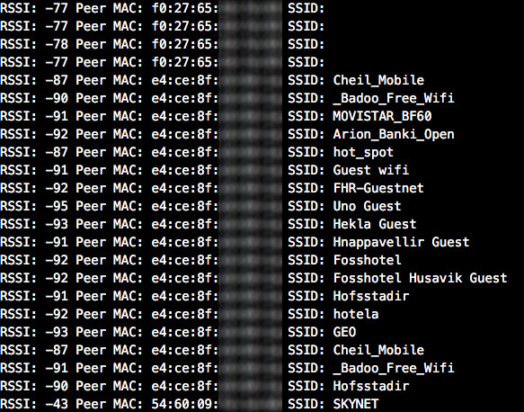

# ESP8266_WIFI-PROBE_REQUEST_SNIFFER

uses the ESP8266 wifi module to look for near smartphones around you. You can do this very easily with any computer and some software but this is a good way to learn the possibilities of these tiny ESP8266 modules.

**VERY IMPORTANT:** *This code is only for educational purposes. We don’t want to listen for any private communication and we don't do it. All packets that you can listen with this code are public packets without any encryption or secure layer on it, continuously broadcasted to the air by smartphones. Please, check which country's laws applies to you before use this code.*

## Introduction

Your phone is constantly searching for all WiFi networks which you already connect  in the past (unless you did remove as "saved"), saying to anyone who is listening for those public packets where you have been before, and of course, your unique device MAC address.

Those public packets are named as "probe requests" and are used by smartphones to connect faster to wifi networks than if it waits for the network send a Beacon frame to announce the SSID.

This program just listen for those "probe requests" and prints to serial port the information. For now only shows the RSSI (bigger values are near devices), the MAC address of the device and the SSID (if available) of the wifi network which is looking for. Something like that:

